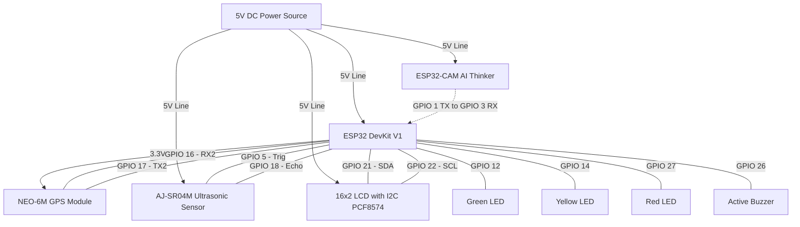

# Hardware Configuration & Wiring Guide

This document details the hardware components, connection pinouts, and power supply scheme for the **Smart Water Logging & Flood Alert Node**.

---

## 1. Component List

| Component | Quantity | Role / Purpose | Operating Voltage |
| :--- | :--- | :--- | :--- |
| **ESP32 DevKit V1** | 1 | Main Controller (ultrasonic measurements, GPS parsing, LCD handling, LEDs/Buzzer logic, backend API upload) | 5V (via Micro-USB) / 3.3V out |
| **ESP32-CAM AI Thinker** | 1 | AI Camera Node (image capture every 5s, AI inference upload to backend) | 5V |
| **AJ-SR04M Sensor** | 1 | Industrial Waterproof Ultrasonic Sensor (measures depth of water logged on road) | 5V |
| **NEO-6M GPS Module** | 1 | Captures real-time node coordinates, speed, and NTP UTC time sync | 3.3V / 5V |
| **16x2 LCD Display** | 1 | Local display for level, GPS coordinates, detected obstacles, and WiFi RSSI | 5V (with I2C PCF8574 module) |
| **Indicators** | 3 (R, Y, G) | Green LED (Safe), Yellow LED (Risky), Red LED (Danger) | 3.3V (with 220Ω resistors) |
| **Active Buzzer** | 1 | Auditory siren triggered during DANGER status | 5V / 3.3V |

---

## 2. Pin Connections Table

### Main ESP32 Node Wiring

| Device / Sensor | Sensor Pin | ESP32 GPIO | Description |
| :--- | :--- | :--- | :--- |
| **AJ-SR04M Ultrasonic** | VCC | 5V (VIN) | Power Input (5V) |
| | GND | GND | Ground |
| | TRIG | GPIO 5 | Trigger pulse output |
| | ECHO | GPIO 18 | Echo pulse input |
| **NEO-6M GPS** | VCC | 3.3V | Power Input |
| | GND | GND | Ground |
| | RX | GPIO 17 (TX2) | Serial Transmit from ESP32 to GPS |
| | TX | GPIO 16 (RX2) | Serial Receive from GPS to ESP32 |
| **I2C 16x2 LCD** | VCC | 5V (VIN) | Power Input |
| | GND | GND | Ground |
| | SDA | GPIO 21 | I2C Data Line |
| | SCL | GPIO 22 | I2C Clock Line |
| **LED Indicators** | Green Anode | GPIO 12 | Safe status (via 220Ω resistor) |
| | Yellow Anode | GPIO 14 | Risky status (via 220Ω resistor) |
| | Red Anode | GPIO 27 | Danger status (via 220Ω resistor) |
| | Cathodes | GND | Common Ground |
| **Active Buzzer** | Positive (+) | GPIO 26 | Alarm trigger pin |
| | Negative (-) | GND | Ground |

### ESP32-CAM to Main ESP32 Serial Sync
*Allows the camera node to send object classification results directly to the main controller's serial console for display on the LCD.*

| ESP32-CAM Pin | Main ESP32 Pin | Description |
| :--- | :--- | :--- |
| **TXD (GPIO 1)** | **RX0 (GPIO 3)** | Serial transmission of detected labels |
| **GND** | **GND** | Common ground (Essential for serial integrity) |

---

## 3. Circuit Diagram (Mermaid Schematic)

The following schematic visualizes the electrical connections between the ESP32 main board and all associated sensors, screens, and alarms:

---

## 4. Power Management Scheme
- The entire system operates off a single **5V 2A DC Power Supply** (via Micro-USB on the ESP32 board or direct Vin rails).
- Due to transient current draws of the ESP32-CAM's flash LED and RF transmissions, it is highly recommended to add a **1000µF capacitor** across the 5V power rails to prevent brownouts.
